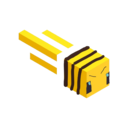

<h1>6Bees</h1>

Meteor Addon specifically made for [6B6T.org](https://www.6b6t.org/)

Please give suggestions on [issues tab](https://github.com/Powie69/6Bees/issues)

## Features

### Modules
- **Ad block**: Blocks ads in various mediums. (chat, bossbar, etc.)
- **Anti base leak**: Prevents accidental base leaks by blocking actions like teleport requests and hotspot creation while inside a base.
- **Anti bed trap**: Prevents you from interacting with any respawn blocks.
- **Anti tinnitus**: Prevents ear strain and tinnitus during intense Crystal PvP.
- **Anti Web**: Prevents you from walking into webs. (but not falling into them)
- **Auto Whisper**: Automatically whispers a message to someone whenever they say a specified keyword.
- **Free Home**: Gives you 2 extra free homes (Not clickbait I swear)
- **NSFW maparts blocker**: Blocks rendering of naughty maparts. This will reference a database.
- **Show Map Id**: Will always show the map ID of maps in its tooltips.

### HUD
- **Base Name**: Shows the name of your current base.
- **Protected Position**: Shows your xyz coordinates unless if you're inside a base.
- **Teleport countdown**: Shows a countdown timer for your next teleportation (e.g when someone accepts your /tpa).
- **Teleport Destination**: Shows where you're heading or who is currently teleporting to you. (e.g. /home /hotspot /tpy /tpa)

### Commands
- **add-base**: Adds a new base to the base system.
- **get-map-id**: Gets the map ID of the currrent map that you're looking at or holding

### Base system

This addon includes a base system that lets you save and manage bases. Bases can be added, edited, or removed from the "Bases" tab in the Meteor ClickGUI. Modules and HUD elements use this shared system to automatically detect when you are inside a configured base and react accordingly.

⭐ Please consider starring ty!
